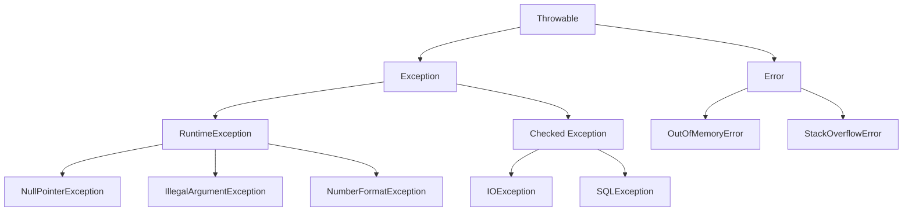
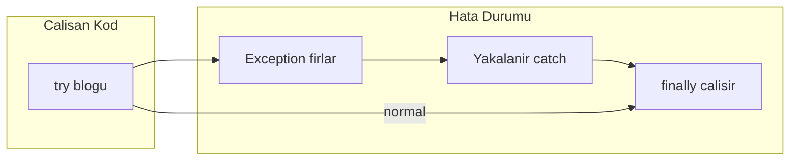

# Java Exception Handling – Temelden Detaylı ve Clean Code Anlatım

Bu doküman, Java **Exception Handling** konusunu en temelden başlayarak, adım adım ve **clean code** prensipleriyle anlatır. Örnek kodlar `src/` altındaki paketlerde bulunur.

---

## 1. Temel Kavramlar

### Exception (İstisna) Nedir?

**Exception**, programın normal akışını bozan, beklenmeyen veya hata durumlarını temsil eden nesnelerdir. Java’da tüm istisnalar `Throwable` sınıfından türeyen yapılardır.

- Program bir hata ile karşılaştığında bir **exception nesnesi** oluşturulur ve **fırlatılır** (thrown).
- Bu nesne yakalanmazsa (uncaught) program sonlanır ve stack trace basılır.
- Yakalanırsa (caught) akış `catch` bloğuna geçer; isteğe bağlı olarak tekrar fırlatılabilir veya işlenebilir.

### Neden Kullanılır?

- **Merkezi hata yönetimi:** Hataları tek bir yapı (exception) ile ifade edip, uygun katmanda ele almak.
- **Çağıran kodu bilgilendirmek:** Metot, “bu işlem başarısız oldu” bilgisini return değeri yerine exception ile iletebilir.
- **Kontrollü davranış:** Programın çökmesini önlemek veya kontrollü kapatma / loglama / kullanıcıya mesaj gösterme.

### Hiyerarşi

Java’da istisna hiyerarşisi şöyledir:



- **Throwable:** Tüm hata/istisna türlerinin üst sınıfı.
- **Error:** JVM veya ciddi sistem hataları (OutOfMemoryError, StackOverflowError). Genelde yakalanmaz; uygulama kodu bunları “düzeltemez”.
- **Exception:** Uygulama mantığında ele alınabilecek istisnalar.
  - **Checked Exception:** Derleyici, bu tür exception’ları ya `try-catch` ile yakalamanızı ya da metot imzasında `throws` ile belirtmenizi zorunlu kılar (örn. IOException, SQLException).
  - **Unchecked Exception (RuntimeException ve alt sınıfları):** Derleyici zorunlu kılmaz; NullPointerException, IllegalArgumentException, NumberFormatException gibi.

Örnek kod: [src/fundamentals/ExceptionHierarchy.java](src/fundamentals/ExceptionHierarchy.java).

---

## 2. Checked vs Unchecked Exception

| Özellik | Checked | Unchecked (RuntimeException) |
|--------|---------|-------------------------------|
| Derleyici | `throws` veya try-catch zorunlu | Zorunlu değil |
| Kullanım | Kurtarılabilir / iletilebilir hatalar | Programlama hataları, geçersiz state |
| Örnek | IOException, SQLException | NullPointerException, IllegalArgumentException |

**Clean code:**

- **Checked:** Sadece gerçekten kurtarılabilecek veya anlamlı şekilde üst katmana iletilebilecek durumlarda kullanın. Gereksiz yere her yere `throws Exception` eklemeyin; çağıranı gereksiz try-catch’e zorlamayın.
- **Unchecked:** Mümkünse hata oluşmadan önce **validasyon** ile önleyin (null kontrolü, argüman kontrolü). Yakaladığınızda en azından **anlamlı mesaj** ve gerekirse **log** ekleyin; boş catch kullanmayın.

**Ne zaman hangisi?**

- Dış kaynak (dosya, ağ, veritabanı) hataları ve “çağıranın yapabileceği bir şey var mı?” sorusuna evet diyorsanız checked mantıklı olabilir.
- Programlama hatası (yanlış argüman, null kullanımı) veya “çağıranın düzeltemeyeceği” durumlar için unchecked (RuntimeException) tercih edilir.

---

## 3. try – catch – finally Temel Kullanım

- **try:** İstisna fırlatabilecek kodu saran blok.
- **catch:** Belirli exception türlerini yakalar. Birden fazla `catch` yazılabilir; **spesifikten genele** doğru sıra önemlidir (örn. önce `IOException`, sonra `Exception`).
- **finally:** Normal çıkış, exception veya erken `return` olsa da (genelde) çalışır; kaynak kapatma için kullanılır. Modern Java’da tercih: **try-with-resources**.

**Clean code kuralları:**

1. **Spesifik exception’ları yakalayın.** Genel `catch (Exception e)` sadece en dış katmanda (örn. tüm isteği saran bir handler) gerekirse kullanılmalı.
2. **Boş catch kullanmayın.** En azından loglayın veya anlamlı bir unchecked exception’a sarıp (wrap) tekrar fırlatın.
3. **catch içinde sadece gerekli işlem olsun.** Karmaşık mantık varsa ayrı metoda taşıyın.

Örnek: [src/trycatch/TryCatchFinallyExample.java](src/trycatch/TryCatchFinallyExample.java).

**Akış (kavramsal):**



---

## 4. throws ve Exception Propagation

Metot imzasında `throws XException` kullanmak: “Bu exception’ı ben burada halletmiyorum; çağıran kod halleder” anlamına gelir.

**Clean code:**

- Üst seviyeye fırlatırken **anlamlı exception türü** ve **açıklayıcı mesaj/context** ekleyin.
- Mümkünse `throws Exception` gibi genel bildirimlerden kaçının; spesifik türler kullanın.
- **Catch and rethrow:** Alt katmanda yakalayıp loglayın veya context ekleyin, sonra daha anlamlı bir exception (veya aynı tür, cause ile) tekrar fırlatın. Cause zincirini korumak (`initCause` veya constructor ile) debug’ı kolaylaştırır.

Örnekler: [src/bestpractices/ExceptionBestPractices.java](src/bestpractices/ExceptionBestPractices.java) içinde propagation ve rethrow örnekleri.

---

## 5. try-with-resources (Clean Code İçin Önemli)

Java 7 ile gelen **try-with-resources**, `AutoCloseable` implement eden kaynakları `try (Resource r = ...)` ile açar; blok bitince (normal veya exception ile) otomatik `close()` çağrılır.

**Neden clean:**

- `finally` ile manuel `close()` ve null kontrolü ortadan kalkar.
- Birden fazla kaynak tek `try` içinde açılabilir; kapatma sırası otomatik ve güvenli.
- **Suppressed exception:** try bloğunda fırlayan exception, close sırasında fırlayan exception’ı “maskelemez”; suppressed olarak eklenir ve erişilebilir kalır.

Örnek: [src/trywithresources/TryWithResourcesExample.java](src/trywithresources/TryWithResourcesExample.java).

---

## 6. Custom Exception (Özel İstisna)

Kendi exception sınıflarınızı yazarken genelde `Exception` (checked) veya `RuntimeException` (unchecked) alt sınıfı oluşturursunuz.

**Clean code:**

- **Anlamlı isim:** `UserNotFoundException`, `InvalidOrderStateException` gibi domain’i yansıtan isimler.
- **Mesaj + cause:** Gerekirse `public XException(String message, Throwable cause)` constructor’ı ekleyin; cause zincirini koruyun.
- **Sadece gerekli alanlar:** orderId, userId gibi gerçekten context için gerekli alanları ekleyin; gereksiz alan eklemeyin.

**Ne zaman custom?**

- Aynı hatayı farklı katmanlarda farklı şekilde ele alacaksanız.
- Domain’e özgü anlam taşıyan ve çağıranın türüne göre karar verebileceği durumlar için.

Örnekler: [src/custom/UserNotFoundException.java](src/custom/UserNotFoundException.java), [src/custom/InvalidOrderStateException.java](src/custom/InvalidOrderStateException.java).

---

## 7. Clean Code Özeti – Exception İçin

| Kural | Açıklama |
|-------|----------|
| **Fail fast** | Geçersiz parametre veya state için hemen exception fırlatın; sessizce devam etmeyin. |
| **Anlamlı mesaj** | Hata nedenini ve mümkünse nasıl düzeltileceğini yazın (özellikle custom exception’da). |
| **Do not swallow** | Catch edip hiçbir şey yapmayın; en azından loglayın veya wrap edip fırlatın. |
| **Spesifik catch, anlamlı rethrow** | Gerekirse cause zincirini koruyun. |
| **try-with-resources** | Kaynak (stream, connection vb.) için finally ile manuel kapatmadan kaçının. |
| **Exception ile akış kontrolü yapmayın** | Normal akış if/state ile yönetilsin; exception sadece olağandışı durumlar için. |

Bu maddelerin uygulandığı örnekler: [src/bestpractices/ExceptionBestPractices.java](src/bestpractices/ExceptionBestPractices.java).

---

## Proje Yapısı

```
Exception Handling/
├── README.md
├── src/
│   ├── fundamentals/
│   │   └── ExceptionHierarchy.java
│   ├── trycatch/
│   │   └── TryCatchFinallyExample.java
│   ├── trywithresources/
│   │   └── TryWithResourcesExample.java
│   ├── custom/
│   │   ├── UserNotFoundException.java
│   │   └── InvalidOrderStateException.java
│   └── bestpractices/
│       └── ExceptionBestPractices.java
```

Her Java sınıfı tek sorumluluk ve okunabilirlik ilkesine göre yazılmıştır; gerekli yerlerde clean code açıklamaları bulunur.
