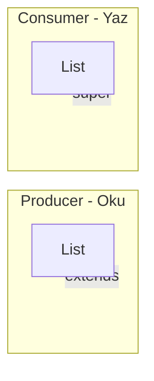

# 4. Wildcards (Joker Tipler) ve PECS

Wildcard (`?`), generic tiplerde **bilinmeyen bir tip**i ifade eder. Üç form vardır; doğru kullanımı PECS kuralıyla özetlenebilir.

## 4.1 Üç Tür Wildcard

### Unbounded: `<?>`

"Herhangi bir tip" anlamına gelir. Tip güvenliği korunur ama **liste içine eleman ekleyemezsiniz** (çünkü gerçek tip belli değildir). Sadece **okuma** için kullanılır.

```java
public void printSize(List<?> list) {
    System.out.println(list.size());
    // list.add("x");  // Derleme hatası: ? bilinmiyor
}
```

### Upper bounded: `<? extends U>`

"U veya U'nun bir alt tipi." Liste **üretici** (producer) gibi davranır: elemanları **okuruz**, türü U veya alt tipi olarak kabul ederiz.

```java
public double sum(List<? extends Number> numbers) {
    double total = 0;
    for (Number n : numbers) {
        total += n.doubleValue();
    }
    return total;
}

// Kullanım:
List<Integer> ints = List.of(1, 2, 3);
List<Double> doubles = List.of(1.0, 2.0);
sum(ints);    // OK
sum(doubles); // OK
```

### Lower bounded: `<? super L>`

"L veya L'nin bir üst tipi." Liste **tüketici** (consumer) gibi davranır: L (veya alt tipi) **yazarız**.

```java
public void addNumbers(List<? super Integer> list) {
    list.add(1);
    list.add(2);
}

// Kullanım:
List<Number> numbers = new ArrayList<>();
List<Object> objects = new ArrayList<>();
addNumbers(numbers);  // OK
addNumbers(objects);  // OK
```

## 4.2 PECS: Producer Extends, Consumer Super

Kısa kural:

- Liste **eleman üretiyorsa** (sadece okuyorsanız) → **`extends`** kullanın.
- Liste **eleman tüketiyorsa** (içine yazıyorsanız) → **`super`** kullanın.

| Rol | Wildcard | Örnek |
|-----|----------|--------|
| Producer (okuma) | `? extends T` | `List<? extends Number>` — sayıları oku |
| Consumer (yazma) | `? super T` | `List<? super Integer>` — integer yaz |

Klasik örnek — `Collections.copy` imzası:

```java
public static <T> void copy(List<? super T> dest, List<? extends T> src)
```

- `src`: T (veya alt tipi) **üretir** → `extends T`
- `dest`: T (veya alt tipi) **tüketir** → `super T`

## Özet diyagram



## Ne yapmalı / Neden kaçınmalı

| Yap | Yapma |
|-----|--------|
| Sadece okuyorsan `? extends T` kullan | Tüketici parametreye `extends` kullanma |
| Sadece yazıyorsan `? super T` kullan | Üretici parametreye `super` kullanma |
| PECS'e göre API imzası tasarla | Hem okuma hem yazma için aynı wildcard'ı zorlama |

## İlgili örnek kod

- `src/main/java/com/generics/wildcards/WildcardExamples.java`
- `src/main/java/com/generics/wildcards/PECSDemo.java`
- `src/main/java/com/generics/wildcards/CopyLikeUtility.java`

Sonraki adım: [Type Erasure (05-type-erasure.md)](05-type-erasure.md)
