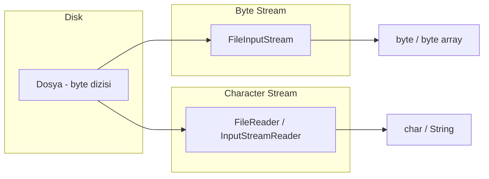
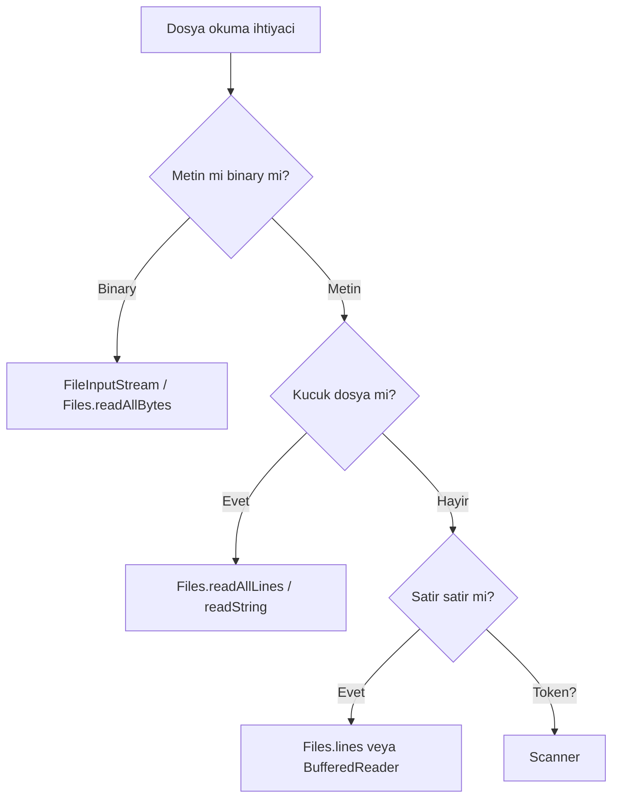

# Java Dosya Okuma – Temelden Detaylı ve Clean Code Anlatım

Bu doküman, Java **dosya okuma** konusunu en temelden başlayarak (byte/character stream, encoding) NIO ve best practice'lere kadar adım adım ve **clean code** prensipleriyle anlatır. Örnek kodlar `src/` altındaki paketlerde bulunur.

---

## 1. Temel Kavramlar

### Dosya Nedir? Byte vs Karakter

Diskteki bir **dosya**, temelde **byte** (bayt) dizisidir. Java’da metin dosyası okurken iki bakış açısı vardır:

- **Byte stream:** Ham byte’ları okur/yazar. Görsel, ses, PDF gibi **binary** dosyalar veya encoding’e göre yorumlamayı sizin yapacağınız durumlar için uygundur.
- **Character stream:** Byte’ları belirli bir **karakter seti (encoding)** ile karaktere çevirir. Metin (.txt, .csv, .json vb.) için kullanılır; encoding doğru seçilmezse karakter bozulması olur.



### Encoding (Karakter Kodlaması)

Metin dosyalarında her karakter bir veya daha fazla byte ile temsil edilir. **Encoding** bu eşleştirmeyi tanımlar:

- **UTF-8:** Genelde varsayılan tercih; Türkçe karakterler (ı, ş, ğ, ü, ö, ç) sorunsuz desteklenir.
- **ISO-8859-1 (Latin-1):** Tek byte; Türkçe için yetersiz kalabilir.
- **UTF-16:** Karakter başına genelde 2 byte.

**Clean code:** Karakter ile okuma/yazmada **her zaman** encoding’i açıkça belirtin (`StandardCharsets.UTF_8` veya `Charset.forName("UTF-8")`). `FileReader(path)` tek başına kullanıldığında JVM varsayılan encoding kullanır; farklı ortamlarda farklı sonuç verebilir.

### File ve Path

- **`java.io.File`:** Eski API; dosya/klasör yolunu ve basit bilgileri (var mı, boyut vb.) temsil eder.
- **`java.nio.file.Path`:** NIO (Java 7+) ile gelen modern yol temsili; `Paths.get("...")` ile oluşturulur. Yeni kodda tercih edilir.

Örnek kod: [src/fundamentals/FileAndPathBasics.java](src/fundamentals/FileAndPathBasics.java).

---

## 2. Byte Stream ile Okuma

**FileInputStream**, dosyayı **byte** veya **byte[]** olarak okur. Binary dosyalar (resim, zip vb.) veya “ham” okuma gerektiğinde kullanılır.

**Önemli:** `InputStream` bir **kaynak**tır; mutlaka kapatılmalıdır. Modern Java’da **try-with-resources** kullanın; `finally` ile manuel `close()` tercih edilmez.

| Ne zaman? | Örnek |
|-----------|--------|
| Binary dosya | Görsel, ses, PDF kopyalama |
| Encoding’i sonra belirleyecekseniz | Byte okuyup `InputStreamReader` ile karaktere çevirme |
| Basit byte okuma | Küçük dosyayı byte[] yapma |

Örnek kod: [src/bytestreams/FileInputStreamExample.java](src/bytestreams/FileInputStreamExample.java).

---

## 3. Character Stream ile Okuma

**FileReader**, dosyayı **karakter** olarak okur; ancak constructor’da encoding belirtemezsiniz — JVM varsayılan encoding kullanılır. Bu, ortamdan ortama değişebildiği için **riskli**dir.

**Doğru yaklaşım:** `InputStreamReader` + `FileInputStream` ile **Charset** verin:

```java
Charset charset = StandardCharsets.UTF_8;
try (Reader reader = new InputStreamReader(new FileInputStream(path), charset)) {
    // ...
}
```

Satır satır okumak için bu `Reader`’ı **BufferedReader** ile sarmak pratik ve verimlidir; bir sonraki bölümde ele alınır.

Örnek kod: [src/characterstreams/FileReaderWithEncoding.java](src/characterstreams/FileReaderWithEncoding.java).

---

## 4. Buffered I/O

**BufferedReader** (ve **BufferedWriter**), karakter stream’leri **tamponlayarak** daha az sistem çağrısı yapar; performans artar. Ayrıca **readLine()** ile satır satır okuma imkânı sağlar.

**Clean code:**

- Okuma mantığını **küçük, tek sorumluluklu** metodlara bölün: örn. `readAllLines(Path path)` → `List<String>`, `readFirstLine(Path path)` → `String`.
- Dosya boşsa veya satır yoksa **null dönmeyin**; boş liste veya boş string döndürün (NullPointerException riskini azaltır).

Örnek kod: [src/buffered/BufferedReaderExample.java](src/buffered/BufferedReaderExample.java).

---

## 5. try-with-resources

Dosya okuma/yazmada açılan her **stream**, **reader** veya **writer** mutlaka kapatılmalıdır. **try-with-resources** (Java 7+), `AutoCloseable` implement eden kaynakları `try (Resource r = ...)` ile açar; blok bitince (normal veya exception ile) otomatik `close()` çağrılır.

**Neden tercih edilir?**

- `finally` ve manuel `close()` / null kontrolü gerekmez.
- Birden fazla kaynak tek `try` içinde açılabilir; kapatma sırası otomatik ve güvenli.
- **Suppressed exception:** try bloğunda fırlayan exception, close sırasında fırlayan exception’ı maskelemez; suppressed olarak eklenir.

Dosya özelinde örnek: [src/trywithresources/FileTryWithResourcesExample.java](src/trywithresources/FileTryWithResourcesExample.java).  
Genel try-with-resources anlatımı için: [Exception Handling – try-with-resources](../Exception%20Handling/README.md#5-try-with-resources-clean-code-için-önemli).

---

## 6. NIO (Path & Files)

**java.nio.file** paketi, dosya/yol işlemleri için modern API sunar:

- **Path / Paths.get():** Yol temsili; `Paths.get("dir", "file.txt")` gibi kullanılır.
- **Files.readAllBytes(Path):** Tüm dosyayı byte[] olarak okur.
- **Files.readAllLines(Path)** veya **Files.readAllLines(Path, Charset):** Tüm satırları `List<String>` yapar; encoding belirtmek clean code için önemli.
- **Files.readString(Path)** / **Files.readString(Path, Charset):** Tüm dosyayı tek String yapar **(Java 11+)**.
- **Files.lines(Path):** Satırları **Stream&lt;String&gt;** olarak verir (Java 8); büyük dosyalarda bellek dostu, lazy okuma.

**Ne zaman NIO?**

- Küçük/orta metin dosyasını tek seferde okumak → `readAllLines` veya `readString`.
- Büyük dosyada satır satır işlem → `Files.lines()`.
- Yol birleştirme, normalize etme → `Path` API’si.

Örnek kod: [src/nio/NioFilesExample.java](src/nio/NioFilesExample.java).

---

## 7. Scanner ile Okuma

**Scanner**, token veya satır bazlı ayrıştırma için kullanılır. Dosyayı `new Scanner(Path, Charset)` veya `new Scanner(File)` ile açabilirsiniz.

**Artıları:** `nextInt()`, `nextDouble()`, `nextLine()` gibi kolay API; basit formatlı dosyalar için uygun.

**Eksileri:** Encoding varsayılan veya constructor’da verilmezse yine platforma bağlı kalır; çok büyük dosyalarda tüm satırları belleğe almak yerine **Files.lines()** veya **BufferedReader** tercih edilebilir.

Örnek kod: [src/scanner/ScannerFileExample.java](src/scanner/ScannerFileExample.java).

---

## 8. Karşılaştırma ve Hangi API Ne Zaman?

| Senaryo | Önerilen yaklaşım |
|--------|-------------------|
| Küçük metin dosyası, tüm içerik bir seferde | `Files.readAllLines(path, charset)` veya `Files.readString(path, charset)` (Java 11+) |
| Büyük metin dosyası, satır satır işlem | `Files.lines(path)` veya `BufferedReader` + try-with-resources |
| Binary dosya | `FileInputStream` veya `Files.readAllBytes(path)` |
| Encoding kritik (Türkçe vb.) | Her zaman **Charset** belirtin; `InputStreamReader` veya NIO’da charset parametreli overload’lar |
| Token/satır ayrıştırma (basit) | `Scanner` (encoding belirterek) |



---

## 9. Clean Code Özeti – Dosya Okuma İçin

| Kural | Açıklama |
|-------|----------|
| **try-with-resources** | Tüm stream/reader/writer açılışlarında kullanın; manuel close ve finally’den kaçının. |
| **Encoding açık** | Karakter okuma/yazmada `StandardCharsets.UTF_8` veya uygun Charset’i her zaman belirtin. |
| **Null yerine boş** | Dosya veya satır yoksa null dönmeyin; boş liste veya boş string döndürün. |
| **Tek sorumluluk** | Okuma mantığını anlamlı isimli, kısa metodlara bölün (readAllLines, readFirstLine vb.). |
| **Exception’ı yutmayın** | Boş catch kullanmayın; en azından loglayın veya wrap edip tekrar fırlatın. |
| **Anlamlı isimler** | Path, charset ve dönen veri için açıklayıcı değişken ve metod isimleri kullanın. |

Bu maddelerin uygulandığı örnek: [src/bestpractices/FileReaderCleanCode.java](src/bestpractices/FileReaderCleanCode.java).

---

## Proje Yapısı

```
Java file reading/
├── README.md
└── src/
    ├── fundamentals/
    │   └── FileAndPathBasics.java
    ├── bytestreams/
    │   └── FileInputStreamExample.java
    ├── characterstreams/
    │   └── FileReaderWithEncoding.java
    ├── buffered/
    │   └── BufferedReaderExample.java
    ├── nio/
    │   └── NioFilesExample.java
    ├── scanner/
    │   └── ScannerFileExample.java
    ├── trywithresources/
    │   └── FileTryWithResourcesExample.java
    └── bestpractices/
        └── FileReaderCleanCode.java
```

Her Java sınıfı tek sorumluluk ve okunabilirlik ilkesine göre yazılmıştır; gerekli yerlerde clean code açıklamaları bulunur.

## Gereksinimler

- **JDK 8** veya üzeri (Files.readString için **Java 11+** önerilir).
- Derleme: `javac` ile paket yapısına uygun şekilde veya IDE üzerinden.

## Derleme ve Çalıştırma

Kaynak kökü `src` kabul edilerek:

```bash
cd "Java file reading"
javac -encoding UTF-8 src/fundamentals/FileAndPathBasics.java
java -cp src fundamentals.FileAndPathBasics
```

Diğer sınıflar için paket adı ve sınıf adına göre `java -cp src paket.SinifAdi` kullanılır.
