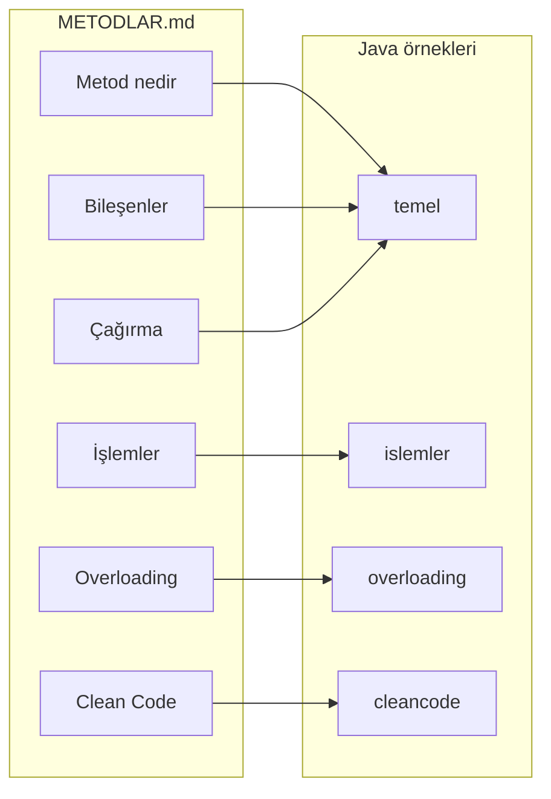

# Java Metodlar, Metodlarda İşlemler ve Overloading

Bu doküman Java'da **metod** kavramını en temelden alarak, **metodlarda işlemler** ve **method overloading** konularını detaylı ve eksiksiz biçimde anlatır. Anlatım boyunca **clean code** ilkelerine uygun örnekler kullanılır.

---

## 1. Metod Nedir?

**Metod**, bir sınıf içinde tanımlanan, tekrarlanabilir ve isimlendirilmiş kod bloklarıdır. Aynı işlemi farklı yerlerde tekrar yazmak yerine bir kez tanımlayıp, gerektiğinde **çağırarak** kullanırız. Bu da kodun okunabilirliğini ve bakımını kolaylaştırır.

### 1.1 Sözdizimi (Syntax)

Genel form:

```java
erişim_belirleyici dönüş_tipi metod_adı(parametre_listesi) {
    // metod gövdesi
    return değer;  // dönüş tipi void değilse
}
```

Örnek:

```java
public static int topla(int a, int b) {
    return a + b;
}
```

- **Erişim belirleyici:** `public` — metoda kimlerin erişebileceği.
- **Dönüş tipi:** `int` — metodun döndüreceği değerin tipi.
- **Metod adı:** `topla` — anlamlı, ne yaptığını söyleyen isim.
- **Parametre listesi:** `(int a, int b)` — metodun dışarıdan aldığı girdiler.
- **Gövde:** `{ ... }` — yapılacak işlemler ve `return` (dönüş tipi `void` değilse).

### 1.2 void ve Dönüş Tipi

- **`void`:** Metod hiçbir değer döndürmez. Sadece iş yapar (örneğin ekrana yazdırma).
- **Dönüş tipi varsa:** Metod mutlaka o tipte bir değer `return` etmelidir.

```java
// void: değer döndürmez
public static void selamla() {
    System.out.println("Merhaba!");
}

// int döner
public static int kareAl(int sayi) {
    return sayi * sayi;
}
```

Örnek sınıf: [`src/temel/MetodTemelleri.java`](src/temel/MetodTemelleri.java).

---

## 2. Metod Bileşenleri

### 2.1 Erişim Belirleyiciler

| Belirleyici | Açıklama |
|-------------|----------|
| `public` | Her yerden erişilebilir. |
| `private` | Sadece kendi sınıfı içinden. |
| `protected` | Aynı paket + alt sınıflar. |
| (yok) | Sadece aynı paket (package-private). |

### 2.2 Parametreler

Parametreler, metoda dışarıdan veri geçirmemizi sağlar. Java'da **pass by value** kullanılır: Metoda primitive veya referansın kopyası gider; parametre üzerinde atama yapmak çağıran taraftaki değişkeni değiştirmez (referansta ise nesnenin içeriği değişebilir).

```java
public static int topla(int a, int b) {
    return a + b;
}
// Çağrı: topla(3, 5)  →  8
```

### 2.3 Lokal Değişkenler ve Kapsam (Scope)

Metod gövdesi içinde tanımlanan değişkenler **lokal**dir. Sadece o metodun içinde geçerlidir; metod bittiğinde kapsamları biter.

```java
public static int maksimum(int a, int b) {
    int sonuc;   // lokal değişken
    if (a >= b) {
        sonuc = a;
    } else {
        sonuc = b;
    }
    return sonuc;
}
```

---

## 3. Metod Çağırma

### 3.1 Aynı Sınıf İçinden Çağırma

Aynı sınıftaki bir metod, doğrudan adıyla çağrılabilir (static ise `static` bağlamdan, değilse nesne üzerinden).

```java
public static void main(String[] args) {
    ekranaYaz("Test");
}
public static void ekranaYaz(String mesaj) {
    System.out.println(mesaj);
}
```

### 3.2 Static ve Instance Metod

- **Static metod:** Sınıfa aittir. Sınıf adıyla çağrılır: `Yardimci.selamla();`
- **Instance metod:** Nesneye aittir. Önce nesne oluşturulur: `new MetodCagirma().instanceSelamla();`

```java
// Static
Yardimci.selamla();

// Instance
MetodCagirma ornek = new MetodCagirma();
ornek.instanceSelamla();
```

Örnek: [`src/temel/MetodCagirma.java`](src/temel/MetodCagirma.java).

---

## 4. Metodlarda İşlemler

Metod gövdesinde her türlü geçerli Java ifadesi kullanılabilir: atama, aritmetik, karşılaştırma, karar yapıları ve döngüler.

### 4.1 Atama ve Aritmetik

```java
public static int toplamDongu(int n) {
    int toplam = 0;
    for (int i = 1; i <= n; i++) {
        toplam += i;
    }
    return toplam;
}
```

### 4.2 Karar Yapıları: if-else, switch

```java
public static int maksimum(int a, int b) {
    if (a >= b) {
        return a;
    } else {
        return b;
    }
}
```

### 4.3 Döngüler: for, while, do-while

```java
// for
for (int i = 0; i < adet; i++) {
    System.out.println("Eleman " + (i + 1));
}

// while
int sayac = 0;
while (sayac < adet) {
    sayac++;
}
```

### 4.4 Erken Çıkış: return ve break

- **return:** Metoddan hemen çıkar, değer döndürür (void ise sadece çıkar).
- **break:** İçinde bulunulan döngüden çıkar.

```java
public static int ilkCiftIndex(int[] dizi) {
    for (int i = 0; i < dizi.length; i++) {
        if (dizi[i] % 2 == 0) {
            return i;   // erken çıkış
        }
    }
    return -1;
}
```

### 4.5 Birden Fazla return vs Tek return

- **Birden fazla return:** Kısa guard clause'lar ve erken çıkışlar için okunabilir olabilir.
- **Tek return:** Bazı ekipler tek bir çıkış noktası tercih eder. Proje tutarlılığına göre seçim yapılır.

Örnek sınıf: [`src/islemler/MetodlardaIslemler.java`](src/islemler/MetodlardaIslemler.java).

---

## 5. Method Overloading

**Overloading (aşırı yükleme):** Aynı metod adı, farklı **parametre listesi** (parametre sayısı veya tipleri farklı) ile birden fazla kez tanımlanabilir. Derleyici çağrıdaki argümanlara göre hangi metodun kullanılacağına karar verir.

### 5.1 Kurallar

- Metod **adı aynı** olmalıdır.
- Parametre listesi **farklı** olmalıdır (tip veya sayı).
- **Dönüş tipi** tek başına farklılık oluşturmaz; overloading için yeterli değildir.

```java
// Geçerli overloading
public static int topla(int a, int b) { return a + b; }
public static double topla(double a, double b) { return a + b; }
public static int topla(int a, int b, int c) { return a + b + c; }
```

### 5.2 Varargs ile Overloading

Varargs (`...`) ile 0 veya daha fazla aynı tipte parametre alınabilir.

```java
public static int topla(int... sayilar) {
    int toplam = 0;
    for (int s : sayilar) {
        toplam += s;
    }
    return toplam;
}
// topla(1, 2, 3)  veya  topla(1, 2, 3, 4)  geçerli
```

### 5.3 Autoboxing ve Overloading

Primitive ve wrapper (örn. `int` / `Integer`) karışık kullanıldığında derleyici otomatik dönüşüm yapabilir. Bazen iki overload da eşit derecede uygun olabilir ve derleme hatası (ambiguous) oluşur. Bu tür çağrılardan kaçınmak veya net bir overload tercih etmek iyidir.

### 5.4 Clean Code

- Overloading’i **anlamlı** kullanın: Aynı işin farklı girdi tipleri/sayıları için (örn. `alan(kenar)` ve `alan(en, boy)`).
- Aşırı sayıda overload yazmaktan kaçının; gerekiyorsa farklı isimler veya parametre nesneleri düşünün.

Örnekler: [`src/overloading/OverloadingOrnekleri.java`](src/overloading/OverloadingOrnekleri.java), [`src/overloading/OverloadingCleanCode.java`](src/overloading/OverloadingCleanCode.java).

---

## 6. Clean Code İlkeleri (Metodlar İçin)

- **Tek sorumluluk:** Bir metod mümkünse tek bir iş yapsın.
- **Kısa metodlar:** Uzunluk okunabilirliği düşürür; gerektiğinde daha küçük metodlara bölün.
- **Anlamlı isimlendirme:** Metod adı ne yaptığını söylesin (`topla`, `kullaniciGecerliMi`).
- **Parametre sayısı:** Mümkünse az tutun; çok parametre gerekiyorsa nesne veya builder düşünün.
- **Yan etkilerden kaçınma:** Metod mümkünse sadece girdi ve çıktı ile çalışsın; tahmin edilebilir dönüş sağlayın.

Örnek: [`src/cleancode/TemizMetodOrnekleri.java`](src/cleancode/TemizMetodOrnekleri.java).

---

## Özet Akış



Tüm örnek sınıflar çalıştırılabilir `main` metoduna sahiptir; proje kökünden derleyip çalıştırarak deneyebilirsiniz.
