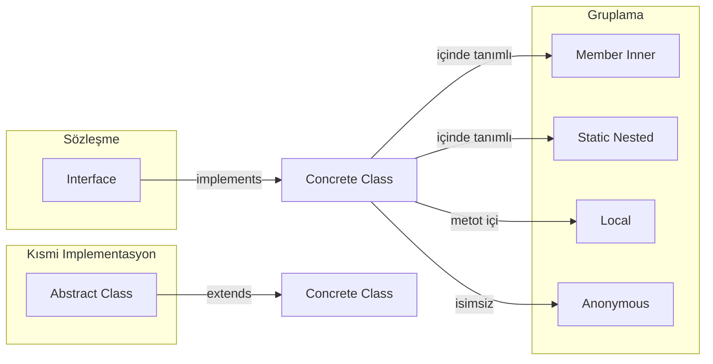

# Java: Interface, Abstract Class ve Inner Class — Temelden Detaylı Anlatım

Bu doküman, Java'da **interface**, **abstract class** ve **inner class** kavramlarını en temelden alarak, Clean Code prensipleriyle eksiksiz açıklar.

---

## İçindekiler

1. [Interface](#1-interface)
2. [Abstract Class](#2-abstract-class)
3. [Inner Class](#3-inner-class)
4. [Kavram Karşılaştırması](#4-kavram-karşılaştırması)
5. [Ne Zaman Hangisi?](#5-ne-zaman-hangisi)

---

## 1. Interface

### 1.1 Tanım

**Interface** (arayüz), bir **davranış sözleşmesi**dir. Hangi metotların olması gerektiğini belirtir; Java 8 öncesinde hiçbir metot gövdesi (implementasyon) içermez ve **state** (örneğin instance alanları) tutmaz. Sadece "ne yapılacağını" söyler, "nasıl yapılacağını" implemente eden sınıfa bırakır.

### 1.2 Temel Sözdizimi

```java
public interface Reportable {
    String getTitle();
    String getContent();
}
```

Bir sınıf bu sözleşmeyi **implements** anahtar kelimesiyle kabul eder ve tüm abstract metotları tanımlamak zorundadır:

```java
public class PdfReport implements Reportable {
    @Override
    public String getTitle() { return "Rapor Başlığı"; }
    @Override
    public String getContent() { return "İçerik..."; }
}
```

Bir sınıf **birden fazla interface** implement edebilir (Java'da çoklu kalıtım sadece interface'ler için geçerlidir):

```java
public class Document implements Reportable, Printable, Saveable {
    // hepsinin metotlarını implement etmek gerekir
}
```

### 1.3 Ne İşe Yarar?

- **Polymorphism**: Interface türünde referans tutup farklı implementasyonları kullanabilirsiniz.
- **Gevşek bağlılık**: Üst seviye kod somut sınıfa değil, arayüze bağımlı olur; implementasyon değişince üst kod değişmez.
- **Test edilebilirlik**: Testte gerçek implementasyon yerine sahte (mock) bir implementasyon verilebilir.

### 1.4 Default Metotlar (Java 8)

Interface'e **varsayılan gövde** eklemek için `default` kullanılır. Böylece eski interface'lere yeni metot eklenirken mevcut implementasyonlar bozulmaz.

```java
public interface Reportable {
    String getTitle();
    String getContent();
    default String getSummary() {
        return getTitle() + ": " + getContent().substring(0, Math.min(50, getContent().length()));
    }
}
```

Çakışma durumu: Bir sınıf iki interface'den aynı isimli default metot alırsa, sınıfın kendisi bu metodu override edip hangi davranışı kullanacağını seçmesi gerekir; aksi halde derleme hatası oluşur.

### 1.5 Static Metotlar

Java 8 ile interface içinde **static** metot da yazılabilir. Genelde o arayüzle ilgili yardımcı işlemler için kullanılır.

```java
public interface Reportable {
    String getTitle();
    String getContent();
    static Reportable createEmpty() {
        return new Reportable() {
            @Override public String getTitle() { return ""; }
            @Override public String getContent() { return ""; }
        };
    }
}
```

### 1.6 Functional Interface ve Lambda

**Functional interface**, tam olarak **bir tane abstract metot** içeren interface'dir. Lambda ifadeleri ve method reference ile kullanılır. `@FunctionalInterface` ile işaretlemek, yanlışlıkla ikinci bir abstract metot eklenmesini engeller.

```java
@FunctionalInterface
public interface Formatter {
    String format(String input);
}
// Kullanım:
Formatter upper = s -> s.toUpperCase();
Formatter lower = String::toLowerCase;
```

### 1.7 Interface vs Abstract (Kısa)

| Özellik           | Interface              | Abstract Class        |
|-------------------|------------------------|------------------------|
| State (alan)      | Yok (Java 8 öncesi)    | Var                    |
| Metot gövdesi     | default/static ile     | Concrete metotlar var |
| Kalıtım sayısı    | Birden fazla implement | Tek extend             |
| Amaç              | Davranış sözleşmesi    | Kısmi implementasyon   |

### 1.8 Clean Code

- **İsimlendirme**: Rol/davranışa göre isim verin: `Payable`, `Comparable`, `Reportable`.
- **Interface Segregation**: Küçük, odaklı interface'ler tercih edin; bir sınıf sadece ihtiyacı olan metotları alacak şekilde ayrı interface'ler tanımlayın.

---

## 2. Abstract Class

### 2.1 Tanım

**Abstract class** (soyut sınıf), tam bir sınıf değildir; en az bir **abstract** metot içerebilir ve doğrudan `new` ile **örneklenemez**. Alt sınıflar bu sınıfı **extends** eder ve abstract metotları implemente eder.

### 2.2 Abstract Metot

Abstract metotta sadece **imza** vardır, gövde yok. Alt sınıf bu metodu mutlaka override etmelidir.

```java
public abstract class Shape {
    protected String name;
    public Shape(String name) { this.name = name; }
    public abstract double area();
    public String getName() { return name; }
}
```

### 2.3 Concrete Metot ve Ortak Kod

Abstract sınıfta hem abstract hem de **concrete** (somut) metotlar bulunabilir. Ortak algoritma iskeleti **Template Method** kalıbıyla yazılır; değişen kısımlar abstract veya override edilebilir metotlara bırakılır.

```java
public abstract class DataProcessor {
    public final void process() {
        open();
        readData();
        transform();
        close();
    }
    protected abstract void readData();
    protected abstract void transform();
    private void open() { /* ortak */ }
    private void close() { /* ortak */ }
}
```

### 2.4 Constructor ve Alanlar

Abstract sınıfta **constructor** ve **protected** alanlar kullanılabilir. Alt sınıf constructor'ı `super(...)` ile bu yapıyı çağırır. Ortak state burada tutulur.

### 2.5 Tek Kalıtım Kısıtı

Java'da bir sınıf yalnızca **bir** sınıftan extend edebilir; ancak aynı anda **birden fazla interface** implement edebilir. Bu yüzden ortak "is-a" ve paylaşılan kod için abstract class, ek davranış sözleşmeleri için interface kullanılır.

### 2.6 Ne Zaman Abstract Class?

- Ortak **state** (alan) ve **ortak davranış** (concrete metotlar) gerektiğinde.
- "Is-a" ilişkisi ve **kısmi implementasyon** (skeleton algoritma) gerektiğinde.
- Template Method veya benzeri kalıplarda iskeleti tek yerde tutmak istediğinizde.

### 2.7 Interface vs Abstract (Özet)

- **State**: Abstract class state tutar, interface (klasik anlamda) tutmaz.
- **Çoklu sözleşme**: Bir sınıf birden fazla interface implement edebilir; yalnızca bir sınıftan extend edebilir.
- **Kalıtım**: Abstract class tek kalıtım; interface ile çoklu "sözleşme" bir arada kullanılabilir.

---

## 3. Inner Class

### 3.1 Neden Var?

- **Mantıksal gruplama**: Bir sınıfı yalnızca başka bir sınıfın bağlamında kullanıyorsanız, onu o sınıfın içinde tanımlayabilirsiniz.
- **Dış sınıfın private'ına erişim**: Inner sınıf, dış sınıfın tüm üyelerine erişebilir.
- **Kısa, odaklı sınıflar**: Listener, callback, iterator gibi tek amaca hizmet eden sınıflar için uygundur.

### 3.2 Türler

| Tür                       | Konum                 | Dış instance'a erişim   | Kullanım                       |
|---------------------------|------------------------|-------------------------|--------------------------------|
| Member (non-static) inner | Sınıf gövdesi         | Var (dış sınıfın this'i)| Iterator, listener             |
| Static nested             | Sınıf gövdesi, static | Yok                     | Yardımcı sınıf, Builder        |
| Local class               | Metot içi             | Var (effectively final) | Tek metotta kullanım           |
| Anonymous                 | Metot içi, isimsiz    | Var                     | Tek seferlik listener/callback |

**Member inner**: Dış sınıfın bir instance'ına bağlıdır; dış sınıfın alanlarına doğrudan erişir.

**Static nested**: Dış sınıfın static üyesi gibidir; dış instance'a ihtiyaç duymaz. Builder veya küçük helper için idealdir.

**Local class**: Bir metot içinde tanımlanır; o metottaki effectively final değişkenlere erişebilir.

**Anonymous**: İsimsiz, tek kullanımlık; çoğu zaman lambda ile de yazılabilir (Runnable, listener vb.).

### 3.3 Clean Code

- **Görünürlük**: Mümkünse **private static nested** tercih edin; dış instance'a ihtiyaç yoksa static kullanmak bellek ve netlik açısından daha iyidir.
- **Tek sorumluluk**: Inner sınıf tek bir işe odaklansın.
- **Karmaşıklık**: Anonymous sınıf çok büyürse, isimli local veya member inner sınıfa çevirmek okunabilirliği artırır.

---

## 4. Kavram Karşılaştırması

Aşağıdaki diyagram, interface, abstract class ve inner class türlerinin konumunu özetler:



---

## 5. Ne Zaman Hangisi?

| İhtiyaç                               | Tercih          | Açıklama                                              |
|---------------------------------------|-----------------|--------------------------------------------------------|
| Sadece davranış sözleşmesi            | **Interface**   | State yok; birden fazla sözleşme implement edilebilir. |
| Ortak state + kısmi kod               | **Abstract**    | Paylaşılan alan ve template metotlar için.            |
| Gruplama / encapsulation / tek yerde  | **Inner class** | Iterator, Builder, listener; dış sınıfa özel mantık.   |
| Çoklu "tür" / rol                     | **Interface**   | Bir sınıf hem X hem Y davranışı için iki interface.   |
| Tek is-a + ortak implementasyon       | **Abstract**    | Örn. Shape → Circle, Rectangle; area() ortak iskelet.  |

Bu tablo ve diyagram, günlük tasarım kararlarında hızlı referans olarak kullanılabilir.
